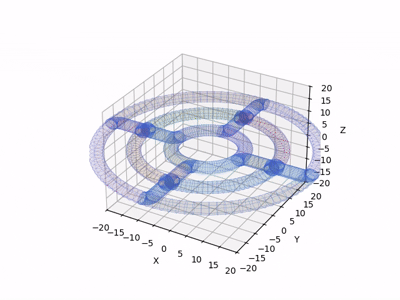

# 三维扇形空域智能体训练项目 / 3D Annulus Airspace Agent Training Project

## 📖 项目介绍 / Project Description

本项目是一个三维扇形空域智能体训练与可视化系统。通过强化学习算法训练智能体在三维扇形空域内进行路径规划和决策，并提供实时可视化功能展示训练结果。

This project is a 3D annulus airspace agent training and visualization system. It trains intelligent agents to perform path planning and decision-making in a 3D annulus airspace using reinforcement learning algorithms, with real-time visualization capabilities to display the training results.

---

## 🗂️ 项目结构 / Project Structure

```
Zones-Airspace/
├── main_annulus.py          # 训练文件 / Training file
├── AnnulusMovie.py          # 可视化文件 / Visualization file
├── annulus.mp4              # 可视化视频 / Visualization result video
└── README.md                # 说明文件 / README
```
---

## 💻 使用说明 / Usage Instructions

### 1. 训练智能体 / Train the Agent

运行 `main_annulus.py` 来训练三维扇形空域中的智能体：

Run `main_annulus.py` to train the agent in the 3D annulus airspace:

```bash
python main_annulus.py
```

**功能 / Functions:**
- 初始化三维扇形空域环境 / Initialize 3D annulus airspace environment
- 配置智能体参数 / Configure agent parameters
- 执行强化学习训练流程 / Execute reinforcement learning training process
- 保存训练结果和模型权重 / Save training results and model weights

**输出 / Output:**
- 训练日志 / Training logs
- 模型文件 / Model files
- 性能指标数据 / Performance metric data

### 2. 可视化训练结果 / Visualize Training Results

运行 `AnnulusMovie.py` 生成可视化视频：

Run `AnnulusMovie.py` to generate visualization videos:

```bash
python AnnulusMovie.py
```

**功能 / Functions:**
- 加载训练好的模型 / Load trained models
- 在三维环境中模拟智能体行为 / Simulate agent behavior in 3D environment
- 生成动画视频展示路径规划和决策过程 / Generate animated videos showing path planning and decision-making processes
- 输出视频文件 / Output video files

**输出 / Output:**
- `annulus.mp4` - 可视化结果视频 / Visualization result video

### 3. 查看可视化结果 / View Visualization Results

---

## 📊 工作流程 / Workflow

```
┌─────────────────────┐
│  main_annulus.py    │  ① 训练智能体
│  (Training)         │     Train Agent
└──────────┬──────────┘
           │ 生成训练结果
           │ Generate results
           ▼
┌─────────────────────┐
│ AnnulusMovie.py     │  ② 生成可视化
│ (Visualization)     │     Generate visualization
└──────────┬──────────┘
           │ 生成视频文件
           │ Create video
           ▼
┌─────────────────────┐
│   annulus.mp4       │  ③ 查看结果
│ (Video Output)      │     View results
└─────────────────────┘
```

---

## 📋 文件说明 / File Descriptions

| 文件名 / Filename | 说明 / Description |
|---|---|
| `main_annulus.py` | 主训练脚本，包含强化学习算法实现 / Main training script with RL implementation |
| `AnnulusMovie.py` | 可视化模块，用于生成3D动画和视频 / Visualization module for 3D animation and video generation |
| `annulus.mp4` | 最终的可视化结果视频 / Final visualization result video |
| `README.md` | 项目文档 / Project documentation |

---

## 📚 相关资源 / Related Resources

- 管道空域基础 / Tube Airspace Basics: (https://github.com/SECNetLabUNM/air-corridor)

---

## 📧 联系方式 / Contact

如有问题或建议，欢迎提交 Issue 或 Pull Request！

For questions or suggestions, feel free to submit an Issue or Pull Request!
